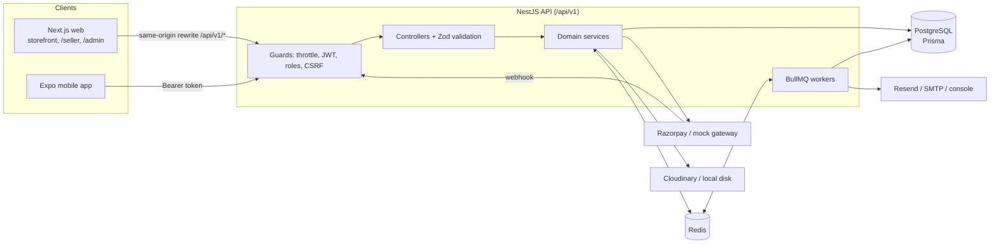
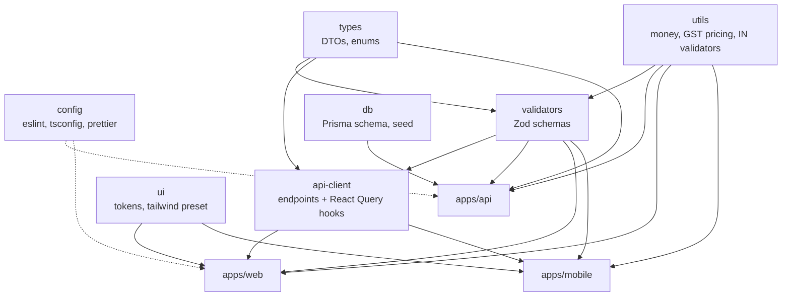
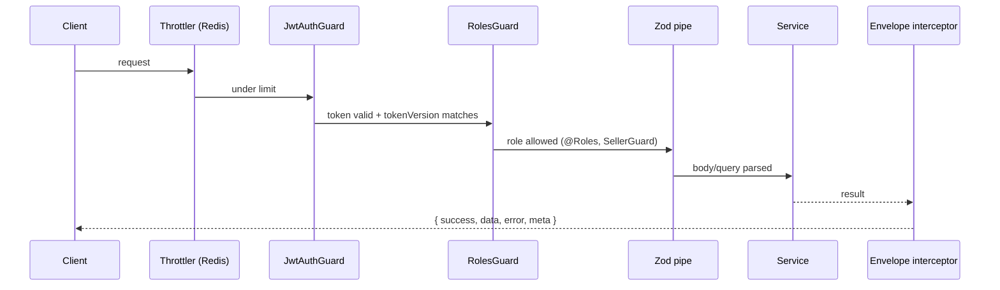
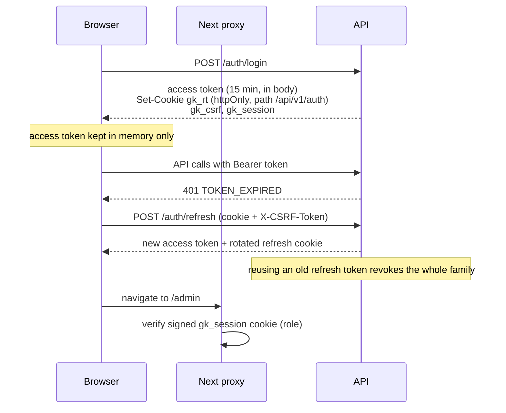
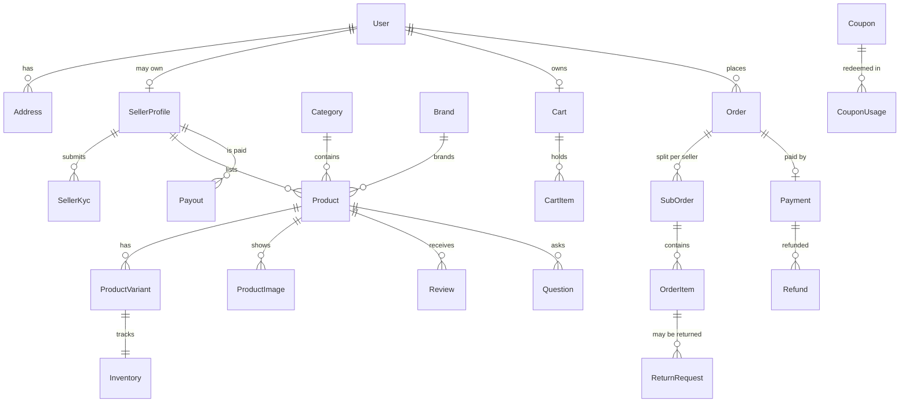
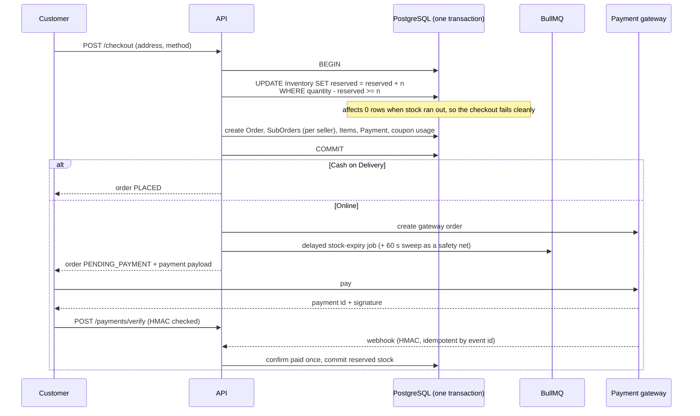
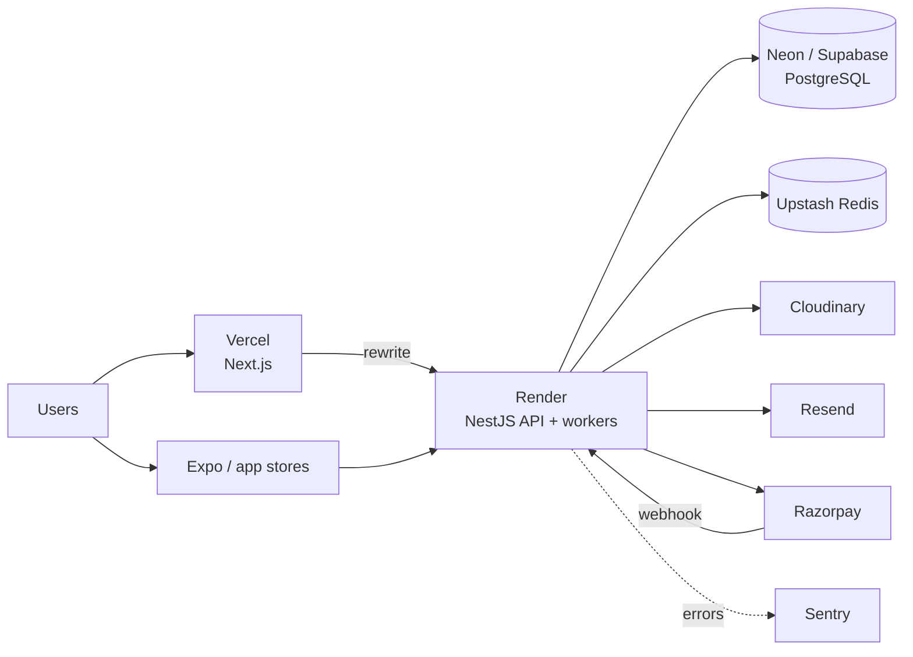

# Architecture

Glideinbir Kart is a Turborepo + pnpm monorepo with one REST API shared by a Next.js web app and an Expo mobile app. This document explains how the pieces fit and why the main design decisions were made.

## 1. System overview

The web app proxies `/api/v1/*` and `/uploads/*` to the API through a Next.js rewrite. The browser therefore only talks to its own origin, which keeps the auth cookies first-party (no third-party-cookie problems, no CORS preflights in the normal path).

## 2. Monorepo layout and dependency direction

Rules that keep this healthy:

- **One source of truth for contracts.** DTO types live in `@gk/types`; request shapes live as Zod schemas in `@gk/validators`. The API validates with them and the web and mobile forms reuse the same schemas, so client and server cannot disagree about a field.
- **One pricing engine.** `@gk/utils` computes cart, checkout, order and invoice totals. Every surface imports the same function.
- **One API client.** `@gk/api-client` holds every endpoint and the React Query hooks. Web and mobile differ only in how they store tokens.
- Shared packages are built with tsup (CJS, ESM and types) except `@gk/ui`, which ships plain tokens and a Tailwind preset. The workspace pins a single React version so shared code never loads a second copy.

## 3. Backend design

### Request pipeline

- Every response uses the envelope `{ success, data, error, meta }`. Errors carry a stable machine `code`, a message and optional per-field `details`.
- Modules are one folder per domain (`auth`, `catalog`, `products`, `search`, `cart`, `orders`, `payments`, `sellers`, `reviews`, `payouts`, `admin`, …). Controllers stay thin; services own the logic.
- `app.setup.ts` holds the HTTP configuration (prefix, URI versioning, helmet, cookies, CORS) and is shared by `main.ts` and the e2e tests, so tests run against the production configuration.

### Authentication and sessions

- **Access tokens** are short-lived JWTs carrying a `tokenVersion`; bumping it on logout-all, password change or block invalidates sessions immediately (checked through a Redis-cached auth state).
- **Refresh tokens** rotate on every use. Presenting an already-used token (after a 10 second grace window for racing tabs) is treated as theft and revokes the family.
- **Web** keeps the refresh token in an httpOnly cookie scoped to `/api/v1/auth`, protects it with a double-submit CSRF token plus an Origin allow-list, and sets a signed `gk_session` cookie that the Next `proxy.ts` uses to protect `/seller` and `/admin` before rendering.
- **Mobile** sends `X-Client-Type: mobile`, receives the refresh token in the body and stores it in SecureStore (Keychain / Keystore). It has no cookies, so CSRF does not apply.
- Customers can also sign in with a phone OTP (returned as `devOtp` outside production).
- RBAC has four roles (`CUSTOMER`, `SELLER`, `ADMIN`, `SUPER_ADMIN`). `@Roles()` guards routes and `SellerGuard` additionally requires an approved seller profile.

### Data model

Notable choices:

- **Money** is `Decimal(12,2)` in PostgreSQL and integer paise inside the pricing engine, so there is no floating point drift. A largest-remainder allocator spreads coupon discounts across lines so parts always sum to the total.
- **Prices are GST-inclusive.** GST is extracted from each line, never added on top; invoices split it into CGST + SGST (same state) or IGST.
- **Soft deletes** on catalogue and user data; CHECK constraints guard inventory (`quantity >= 0`, `reserved <= quantity`).
- **Dynamic attributes** (colour, size, storage…) live in `jsonb` with a GIN index, driven by per-category attribute definitions that the admin manages.
- One migration creates the schema; a second adds the search machinery (extensions, triggers, indexes, constraints) in SQL.

### Search

PostgreSQL does everything, no external engine:

- A `tsvector` column on `Product` is kept current by a trigger and indexed with GIN (weights: name, brand and category above description).
- `pg_trgm` provides typo tolerance (`word_similarity`) and "did you mean" suggestions, and powers autocomplete.
- Filters (price, brand, rating, discount, stock, dynamic attributes) and facet counts come from the same base query, so counts always match the visible results.

### Checkout and inventory

- Stock is reserved with a single conditional `UPDATE`, which makes overselling impossible under concurrency (covered by an e2e test where two shoppers race for the last unit).
- Unpaid online orders expire: a delayed job releases the reservation and the coupon use, with a periodic sweep in case a job is lost.
- Payment confirmation is idempotent from both paths (client verify and webhook), guarded by a `WebhookEvent` table.
- When no Razorpay keys are configured, a mock gateway with the same order, payment and signature contract takes over, so the full flow works offline and in tests.
- Each seller gets a **sub-order** with its own status (accept, pack, ship, deliver). The parent order status is derived from the sub-orders. Commission is computed on the taxable value before coupons (seller override, then nearest category rule, then global, then the default setting); coupons are platform-funded.

### Caching and background work

- **Cache** namespaces in Redis are versioned: invalidating "products" bumps one counter, so thousands of cached keys die in O(1) with no key scans. Home, catalogue, categories, settings and popular searches are cached.
- **Guest carts** live in Redis keyed by an `X-Guest-Cart-Id` header and are merged into the user cart at login.
- **Queues** (BullMQ): `emails`, `invoices`, `notifications`, `stock-expiry`, `search-index`. Workers run inside the API process by default (free-tier friendly) and can be disabled with `WORKERS_ENABLED=false`.
- Redis also stores OTP codes, rate-limit counters and the auth-state cache.

## 4. Web app

- Next.js 16 App Router. Public catalogue pages use ISR (`revalidate`) so they are fast and SEO friendly; account, cart and checkout are client-driven.
- SEO: metadata per page, JSON-LD `Product` and breadcrumbs, `sitemap.xml`, `robots.txt`, dynamic Open Graph images.
- State: TanStack Query for server state (hooks from `@gk/api-client`), a small Zustand store for the in-memory access token, react-hook-form with the shared Zod schemas for forms.
- Seller and admin consoles share a dashboard shell. Tables use TanStack Table with **server-side** pagination, sorting and filtering, so they stay fast with large data. Charts use a validated colour-blind-safe palette exposed as CSS variables, with light and dark variants.
- Design tokens come from `@gk/ui`: an ink-indigo and marigold palette with warm neutrals, defined once and consumed by Tailwind on web and NativeWind on mobile.

## 5. Mobile app

- Expo SDK 57 with expo-router (file-based routes under `src/app`), NativeWind for styling and the same design tokens as the web.
- The same `@gk/api-client` hooks power the screens. Only public catalogue queries are persisted to AsyncStorage for fast cold starts; carts, orders and profile data are never written to disk.
- Refresh token in SecureStore, access token in memory, transparent refresh on `TOKEN_EXPIRED`.
- Push notifications register an Expo push token with the API; tapping a notification deep-links to the order, product or returns screen.
- Payments: the mock gateway and COD run anywhere. Real Razorpay uses the native SDK, loaded lazily so Expo Go does not crash without it.
- Metro is configured to resolve React, React Native and React Query from the app's own `node_modules`, preventing duplicate copies from shared workspace packages.

## 6. Security measures

| Area      | Measure                                                                                                           |
| --------- | ----------------------------------------------------------------------------------------------------------------- |
| Passwords | argon2 hashing; generic login errors that do not reveal which part was wrong                                      |
| Sessions  | Short access tokens, rotating refresh tokens with reuse detection, server-side revocation                         |
| CSRF      | Double-submit token plus Origin allow-list for cookie-authenticated requests                                      |
| Input     | Zod validation on every endpoint, HTML and control character sanitisation of user strings                         |
| Abuse     | Redis-backed rate limiting, stricter limits on auth and OTP                                                       |
| Headers   | helmet, strict CORS allow-list                                                                                    |
| Payments  | HMAC signature verification with constant-time comparison, idempotent webhooks, amounts computed server-side only |
| Access    | RBAC guards plus ownership checks (customers only see their orders, sellers only their sub-orders)                |
| Uploads   | Type and size limits, stored outside the web root                                                                 |
| Audit     | Admin and seller actions are recorded in an audit log                                                             |

## 7. Testing strategy

| Layer     | Tool                                    | What it covers                                                                                      |
| --------- | --------------------------------------- | --------------------------------------------------------------------------------------------------- |
| Packages  | Vitest                                  | Money, GST pricing, coupon maths, validators, India-specific formats                                |
| API units | Jest                                    | Coupon rules, commission resolution, payment signatures, sanitising, date ranges                    |
| API e2e   | Jest + Supertest on a separate database | Auth and token rotation, RBAC, search, cart, COD and online checkout, webhooks, oversell protection |
| Web e2e   | Playwright                              | Sign-up to order placement, mock payment, access control, phone-width layout                        |
| Mobile    | `tsc` + `expo export`                   | Type safety and a successful Metro and NativeWind bundle                                            |
| CI        | GitHub Actions                          | All of the above on every push and pull request                                                     |

## 8. Deployment topology (free tiers)

The API is stateless apart from Redis and PostgreSQL, so it can scale horizontally; BullMQ coordinates workers through Redis, and the stock-expiry sweep is safe to run on several instances.
